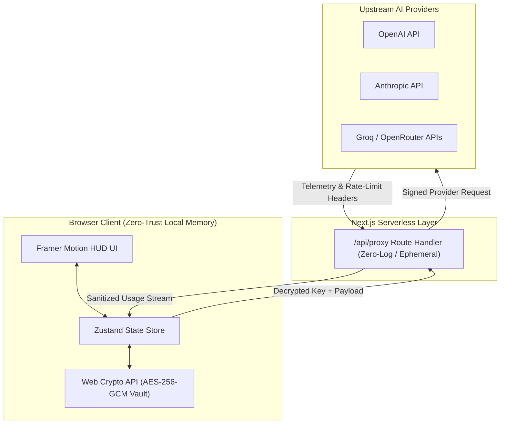

# ⚡ TokenDash

> **Privacy-First, Real-Time AI Telemetry & API Key Management Dashboard**

[](https://nextjs.org/)
[](https://www.typescriptlang.org/)
[](https://tailwindcss.com/)
[](https://developer.mozilla.org/en-US/docs/Web/API/SubtleCrypto)
[](LICENSE)

TokenDash is a zero-knowledge, local-first telemetry HUD engineered for AI teams, developers, and founders. It aggregates multi-provider token consumption, tracks real-time API latency, projects monthly spend, and manages provider secrets—without sending raw API credentials or usage logs to third-party databases.

---

## 🏛️ System Architecture

TokenDash enforces a **Client-Side Cryptographic Paradigm** paired with a stateless edge relay to bypass CORS restrictions while maintaining absolute data isolation.



---

## 🛡️ Threat Model & Security Boundaries

TokenDash treats the network and third-party servers as untrusted zones. All credentials and sensitive telemetry remain bound to the client execution environment.

| Threat Vector | Mitigation Strategy | Security Boundary |
| :--- | :--- | :--- |
| **Server-Side Key Leaks** | Zero-knowledge design; raw API keys are never written to server disks or database tables. | **Client-Side Storage** |
| **Storage Interception** | Master passcodes derive cryptographic keys via `PBKDF2` (100,000+ iterations) before writing to `localStorage`. | **Browser Vault** |
| **CORS & IP Exposure** | Next.js serverless route handler (`/api/proxy`) masks client origin and handles provider-specific CORS rules. | **Edge Network** |
| **XSS / Memory Dump** | Keys reside in non-extractable CryptoKey objects in volatile heap memory and flush on window unload. | **Application Memory** |

---

## 🔑 Cryptographic Specifications

- **Encryption Algorithm:** `AES-256-GCM` (Galois/Counter Mode) providing authenticated encryption with associated data (AEAD).
- **Initialization Vector (IV):** Dynamic 96-bit cryptographically secure random IV generated per key entry using `crypto.getRandomValues()`.
- **Key Derivation Function (KDF):** `PBKDF2` with `SHA-256`, utilizing a dynamic 128-bit salt and a minimum iteration count of 100,000.
- **Key Lifecycle:** Passcodes and derived keys are retained purely in volatile JavaScript runtime heap memory; zero plain-text values are ever stored in `localStorage` or `IndexedDB`.

---

## ⚡ Key Features

- **🔐 Zero-Knowledge Web Crypto Vault:** Hardware-accelerated client-side encryption for provider keys using your master passcode.
- **🌐 Unified Multi-Provider Aggregation:** Standardized token metrics, latency charts, and error rates across **OpenAI**, **Anthropic**, **Groq**, **Gemini**, and **OpenRouter**.
- **📊 Real-time Cyberpunk HUD:** Animated metric streams, interactive burn-rate charts, and active provider status indicators styled with a `#090a0f` obsidian background and cyan glowing accents.
- **🧪 Interactive Sandbox Engine:** Mock mode allowing comprehensive UI testing, telemetry visualization, and stress-testing without expending live API credits.
- **📥 Audit & Telemetry Export:** Instant log filtering across time windows (`24h`, `7d`, `30d`) with one-click export to **CSV** and **JSON**.

---

## 🛠️ Tech Stack

| Domain | Technology |
| :--- | :--- |
| **Framework** | Next.js 16 (App Router, Turbopack) |
| **Language** | TypeScript |
| **Styling & Motion** | Tailwind CSS, Framer Motion, Lucide React Icons |
| **State Management** | Zustand (with selective persistence) |
| **Cryptography** | Native Web Crypto API (`window.crypto.subtle`) |
| **Tooling & Insights** | pnpm, Vercel Speed Insights, Vercel Analytics |

---

## 🚀 Getting Started

### Prerequisites

- **Node.js**: `v18.0.0` or higher
- **pnpm**: `v8.0.0` or higher (`npm install -g pnpm`)

### Local Setup

```bash
# 1. Clone the repository
git clone [https://github.com/Rihan-R10/tokendash.git](https://github.com/Rihan-R10/tokendash.git)
cd tokendash

# 2. Install dependencies
pnpm install

# 3. Start the development server
pnpm dev
```

Open [http://localhost:3000](http://localhost:3000) in your browser to launch the dashboard.

---

## 📜 License

Distributed under the **MIT License**. See [`LICENSE`](LICENSE) for full details.